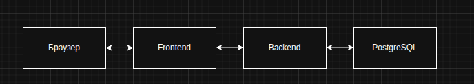

# PinTheMap – Полная спецификация проекта

## 1. О проекте

**PinTheMap** - это веб-приложение, в котором игроку предлагается угадать местоположение известных городов на интерактивной карте. Игра использует библиотеку Leaflet для отображения карты без подписей. Игрок кликает по карте, чтобы отметить предполагаемое место города, затем нажимает «Подтвердить». Система вычисляет расстояние между отметкой и истинными координатами города и начисляет очки: чем точнее попадание, тем больше очков. После подтверждения на карте появляется правильный маркер и пунктирная линия, соединяющая обе точки.

---

## 2. Философия и пользовательский опыт

### Наш пользователь
**Имя:** Александр, 28 лет.
**Род занятий:** Системный администратор, увлекается географией и историей.
**Поведение:** Проводит много времени за компьютером. Любит интеллектуальные вызовы и короткие сессии в браузере, чтобы отвлечься от рутины. Ценит чистый, минималистичный дизайн и отсутствие навязчивой рекламы. Играет с ноутбука, реже — с планшета.

### Какую проблему он решает?
Александр хочет проверить свои знания географии в увлекательной и честной форме, посоревноваться с самим собой (или в будущем с друзьями) и улучшить свои навыки определения мест на карте. Ему важно видеть прогресс и иметь возможность анализировать свои ошибки.

### Его окружение
- **Устройства:** Ноутбук с Firefox/Chrome, планшет iPad.
- **Освещение:** Дневной свет или искусственный свет вечером.
- **Контекст:** Короткие перерывы между задачами на работе или расслабление дома.

---

## 3. Пользовательские истории (User Stories)

**История 1: Начало игры**
> Как игрок, я хочу видеть понятный интерфейс с моим текущим счетом и заданием, чтобы сразу понять, что мне нужно делать.

**История 2: Процесс угадывания**
> Как игрок, я хочу кликнуть на карту без подсказок, чтобы отметить предполагаемое местоположение города, и иметь возможность изменить свою точку до подтверждения.

**История 3: Получение обратной связи**
> Как игрок, после подтверждения я хочу мгновенно увидеть:
> * Правильное местоположение города.
> * Линию, соединяющую мою ошибку с правильным ответом.
> * Четкую информацию: сколько километров я ошибся и сколько очков заработал.
> * Визуальное подтверждение, чтобы почувствовать удовлетворение от ответа.

**История 4: Прогресс и мотивация**
> Как игрок, я хочу, чтобы мой общий счет увеличивался, и видеть список моих последних результатов, чтобы отслеживать свой прогресс и стремиться побить свой рекорд.

**История 5: Идентификация и сохранение данных**
> Как игрок, я хочу, чтобы мой прогресс (счет, статистика) сохранялся между сессиями. Если я зайду с другого устройства или через месяц, я хочу видеть свой накопленный результат, а не начинать с нуля. Для этого я готов войти в систему.

**История 6: Анализ результатов**
> Как игрок, я хочу иметь доступ к истории своих игр (какой город был предложен, где я ошибся, сколько км не угадал), чтобы проанализировать свои слабые места.

**История 7: Социализация (будущая фича)**
> Как игрок, я хочу видеть рейтинг других игроков или соревноваться с друзьями, чтобы добавить элемент состязательности в игру.

---

## 4. Технологический стек

### Фронтенд
- **React** - пользовательский интерфейс
- **Vite** - сборка и dev-сервер
- **Leaflet** + **react-leaflet** - интерактивная карта
- **CSS3** - стилизация
- **JavaScript (ES6+)** – логика приложения
- **Fetch/Axios** - HTTP-клиент для взаимодействия с бэкендом

### Бэкенд
- **Python** + **FastAPI** (высокопроизводительный асинхронный фреймворк)
- **PostgreSQL** - реляционная база данных
- **JWT** - аутентификация
- **SQLAlchemy** или **asyncpg** - работа с БД

---

## 5. Архитектура приложения

### Диаграмма взаимодействия



### Структура проекта (фронтенд)

```
src/
├── components/
│   ├── Header.jsx - шапка с отображением счёта и кнопкой профиля
│   ├── Footer.jsx - подвал (статическая информация)
│   ├── Sidebar.jsx - универсальная боковая панель (левая/правая)
│   ├── MapComponent.jsx - компонент карты с маркерами, линией и обработкой кликов
│   ├── AuthModal.jsx - модальное окно для входа/регистрации
│   └── ProfilePage.jsx - страница профиля со статистикой
├── contexts/
│   └── AuthContext.jsx - контекст для управления состоянием аутентификации
├── services/
│   └── api.js - функции для HTTP-запросов к бэкенду
├── App.jsx - главный компонент: состояние игры, выбор города
├── App.css - глобальные стили для всех компонентов
├── main.jsx - точка входа, рендеринг App
├── index.css - базовые сбросы и настройки темы
└── index.html - основной HTML
```

### Структура Базы Данных (PostgreSQL)

#### Таблица `users`
| Колонка | Тип | Описание |
|---|---|---|
| `id` | SERIAL PRIMARY KEY | Уникальный идентификатор пользователя |
| `username` | VARCHAR(50) UNIQUE NOT NULL | Имя пользователя |
| `email` | VARCHAR(100) UNIQUE NOT NULL | Email |
| `password_hash` | VARCHAR(255) NOT NULL | Хеш пароля |
| `total_score` | INTEGER DEFAULT 0 | Суммарный счет пользователя |
| `games_played` | INTEGER DEFAULT 0 | Количество сыгранных раундов |
| `created_at` | TIMESTAMP DEFAULT NOW() | Дата регистрации |

#### Таблица `cities`
| Колонка | Тип | Описание |
|---|---|---|
| `id` | SERIAL PRIMARY KEY | Уникальный идентификатор города |
| `name` | VARCHAR(100) NOT NULL | Название города |
| `latitude` | DECIMAL(9,6) NOT NULL | Широта |
| `longitude` | DECIMAL(9,6) NOT NULL | Долгота |
| `hint` | TEXT | Подсказка (опционально) |

#### Таблица `game_sessions`
| Колонка | Тип | Описание |
|---|---|---|
| `id` | SERIAL PRIMARY KEY | Уникальный ID попытки |
| `user_id` | INTEGER REFERENCES users(id) ON DELETE CASCADE | Пользователь |
| `city_id` | INTEGER REFERENCES cities(id) | Предложенный город |
| `guessed_lat` | DECIMAL(9,6) | Широта клика игрока |
| `guessed_lng` | DECIMAL(9,6) | Долгота клика игрока |
| `actual_lat` | DECIMAL(9,6) | Реальная широта (денормализация для удобства) |
| `actual_lng` | DECIMAL(9,6) | Реальная долгота |
| `distance_meters` | INTEGER | Расстояние в метрах |
| `points_earned` | INTEGER | Начисленные очки |
| `played_at` | TIMESTAMP DEFAULT NOW() | Дата и время попытки |

---

## 6. Ключевые компоненты и их пропсы (фронтенд)

### `App.jsx` (главный компонент)
- **Состояния (useState)**:
  - `user` (object или null) - данные текущего пользователя
  - `token` (string или null) - JWT токен
  - `score` (number) – текущий счёт игрока
  - `currentCity` (object или null) - выбранный город: `{ id, name, coords }`
  - `guessedCoords` (array или null) - координаты клика игрока
  - `lastResult` (object или null) - результат последней попытки: `{ distance, earned }`
  - `isLoading` (boolean) - состояние загрузки

- **Основные функции**:
  - `fetchNewCity()` – запрашивает новый город с сервера
  - `handleMapClick(coords)` - сохраняет координаты клика
  - `handleSubmit()` - отправляет догадку на сервер, обновляет счет
  - `handleNext()` - переходит к следующему городу
  - `login/register/logout` - функции аутентификации

### `Header.jsx`
- **Пропсы**:
  - `score` (number) - текущий счёт
  - `user` (object или null) - данные пользователя
  - `onProfileClick` (function) – открыть профиль
  - `onLoginClick` (function) – открыть модалку входа

### `MapComponent.jsx`
- **Пропсы**:
  - `currentCity` (object или null) – текущий город
  - `guessedCoords` (array или null) – координаты предположения
  - `onMapClick` (function) - обработчик клика
  - `showLine` (boolean) - показывать ли линию и маркер города
- **Особенности**:
  - Тайлы: CartoDB `light_nolabels` (карта без подписей)
  - Маркер города показывается только если `showLine === true`
  - Маркер игрока показывается всегда при наличии координат
  - Красная пунктирная линия соединяет точки после подтверждения

---

## 7. API Endpoints (бэкенд)

### Аутентификация
| Метод | Эндпоинт | Описание | Тело запроса | Ответ |
|---|---|---|---|---|
| POST | `/api/auth/register` | Регистрация | `{ username, email, password }` | `{ user, token }` |
| POST | `/api/auth/login` | Вход | `{ email, password }` | `{ user, token }` |
| GET | `/api/auth/me` | Получить текущего пользователя | (Headers: `Authorization`) | `{ user }` |

### Игровые
| Метод | Эндпоинт | Описание | Тело запроса | Ответ |
|---|---|---|---|---|
| GET | `/api/game/start` | Начать игру/получить город | (Headers: `Authorization`) | `{ score, city: { id, name, coords } }` |
| POST | `/api/game/submit-guess` | Отправить догадку | `{ city_id, guessed_coords }` | `{ actual_coords, distance_km, earned_points, new_total_score }` |

### Профиль
| Метод | Эндпоинт | Описание | Ответ |
|---|---|---|---|
| GET | `/api/user/profile` | Получить профиль и историю | `{ total_score, games_played, recent_games: [...] }` |
| GET | `/api/user/history` | Получить историю игр | `{ games: [...] }` |

---

## 8. Стилизация (CSS)

### Основные цвета
- **Фон страницы** - `#242424`
- **Шапка, подвал, боковые панели** - `#242424` (тёмный фон)
- **Контейнер с картой** - градиент: `linear-gradient(to bottom, #1c295e, #080c1c)`
- **Счёт** – `#242424` фон, белый текст
- **Кнопка профиля** - градиент `linear-gradient(to bottom, #1c295e, #080c1c)`, при наведении `#1c295e`
- **Обычные кнопки** - фон `#4a6fa5`, при наведении `#3a5a8c`

### Шрифты
- **Основной:** Montserrat, жирное начертание (700)
- **Запасной:** системный шрифт `system-ui, Avenir, Helvetica, Arial, sans-serif`

### Ключевые CSS-классы
- `.header`, `.footer` - верхний и нижний блоки
- `.sidebar` - общие стили панелей (ширина 250px, скругления, тень)
- `.container` - центральный контейнер с тремя колонками
- `#map` - контейнер карты (1400x700, рамка, тень)
- `.coords-display` - блок для координат в правой панели
- `.auth-modal` - модальное окно для входа/регистрации

---

## 9. Формула начисления очков

```javascript
const maxScore = 100;        // Максимум очков за идеальное попадание
const maxDistance = 500000;  // 500 км (если ошибка больше, очки не начисляются)

// distance - расстояние в метрах между точкой игрока и реальным городом
const earned = Math.round(maxScore * Math.max(0, 1 - Math.min(distance, maxDistance) / maxDistance));

// Примеры:
// 0 км → 100 очков
// 250 км → 50 очков
// 500+ км → 0 очков
```

**Важно:** Расчет выполняется на сервере, чтобы исключить возможность подделки результата на клиенте.

---

## 10. План разработки (MVP)

### Этап 1: Фронтенд без бэкенда (прототип)
- [x] Базовая структура компонентов
- [x] Интерактивная карта с Leaflet
- [x] Логика выбора города и подсчета очков в памяти
- [x] Стилизация

### Этап 2: Бэкенд и база данных
- [ ] Настройка FastAPI сервера
- [ ] Создание таблиц в PostgreSQL
- [ ] Наполнение таблицы `cities` (первые 50 городов)
- [ ] Реализация API для игры (start, submit-guess)

### Этап 3: Аутентификация
- [ ] Регистрация и вход (JWT)
- [ ] Компонент AuthModal на фронтенде
- [ ] Сохранение токена и контекст авторизации

### Этап 4: Интеграция
- [ ] Подключение фронтенда к реальному API
- [ ] Сохранение игровой статистики в БД
- [ ] Страница профиля с историей игр

### Этап 5: Улучшения
- [ ] Адаптивный дизайн (планшеты)
- [ ] Анимации переходов
- [ ] Звуковые эффекты (опционально)

---

## 11. Заключение

Проект **PinTheMap** развивается от простого фронтенд-прототипа к полноценному веб-приложению с бэкендом на Python и PostgreSQL. Это позволит:

1. Сохранять прогресс пользователей между сессиями
2. Обеспечить честность игры (вычисления на сервере)
3. Собирать статистику для анализа и улучшения игры
4. В будущем добавить социальные функции (рейтинги, друзья)
